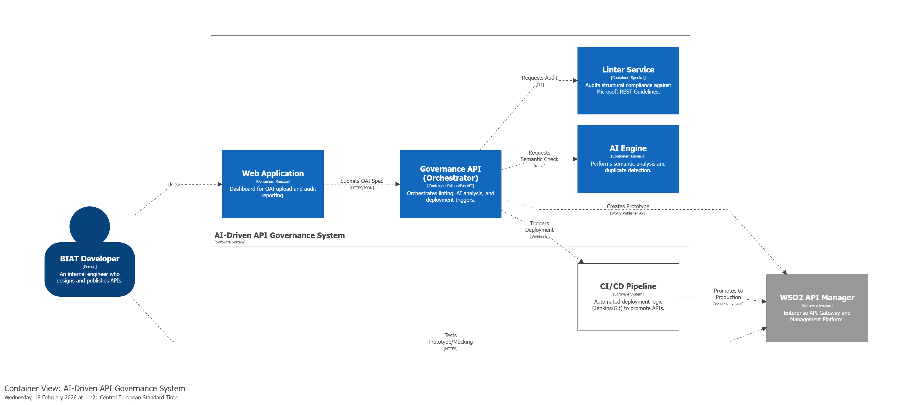
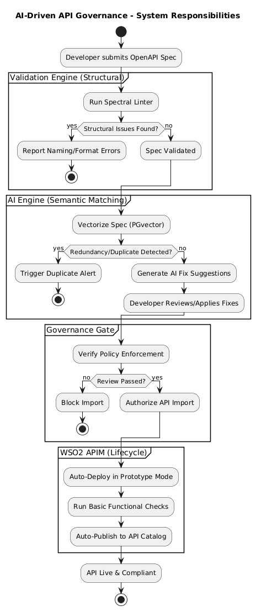
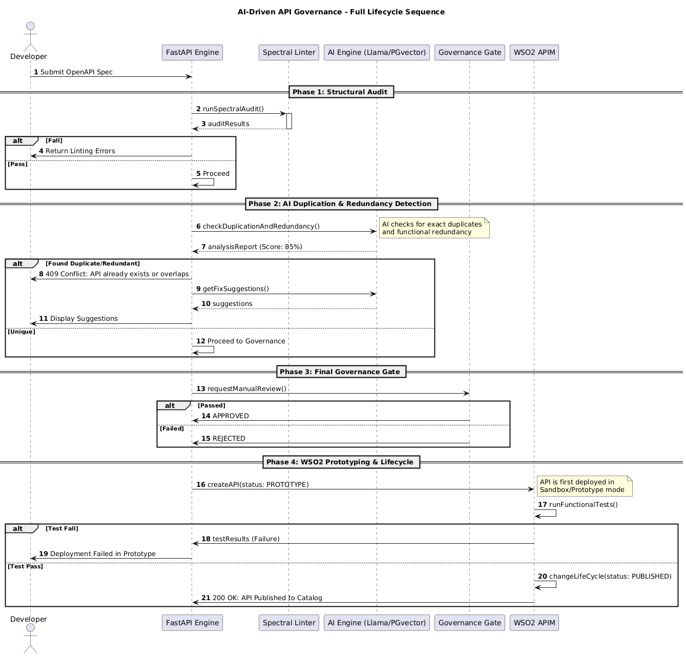
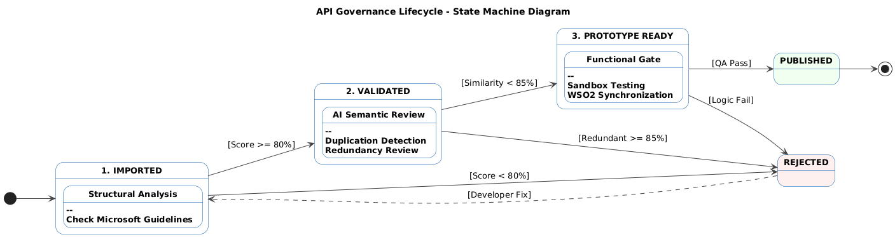

# AI-Driven OpenAPI Governance & Integration Layer

[](https://fastapi.tiangolo.com/)
[](https://www.docker.com/)
[](https://wso2.com/api-management/)
[](https://www.postgresql.org/)
[](https://reactjs.org/)
[](https://www.python.org/)
[](https://prometheus.io/)
[](https://grafana.com/)

> **Production-grade API governance engine built for BIAT — Tunisia's leading private bank.**  
> Automates the full OpenAPI lifecycle from upload to WSO2 deployment using AI-driven validation,  
> reducing manual validation effort by **60%** across **50+ API specifications**.

---

## The Problem This Solves

Enterprise API ecosystems suffer from **API sprawl** — duplicate endpoints, inconsistent naming,
missing security fields, and manual review bottlenecks that slow down every release cycle.

At BIAT, APIs were reviewed manually before publication. This was slow, inconsistent,
and didn't scale. This system replaces that manual process with an automated governance gate
that every API specification must pass before reaching the production catalog.

---

## How It Works

Every OpenAPI specification submitted goes through four sequential gates:



```
Developer submits spec
        │
        ▼
┌─────────────────────┐
│  1. Structural Lint  │  Spectral enforces Microsoft REST API Guidelines
└──────────┬──────────┘
           │
           ▼
┌─────────────────────┐
│  2. Semantic Check   │  PGVector detects duplicate API intent
└──────────┬──────────┘
           │
           ▼
┌─────────────────────┐
│  3. AI Validation    │  Qwen 2.5 LLM catches logical inconsistencies
└──────────┬──────────┘
           │
           ▼
┌─────────────────────┐
│  4. Governance Gate  │  Score thresholds decide: PUBLISH or REJECT
└──────────┬──────────┘
           │
           ▼
  WSO2 API Manager
  (automated deployment)
```

An API only reaches production if it passes **all four gates**.

---

## Key Results

| Metric | Result |
|---|---|
| Manual validation effort reduced | **60%** |
| API specifications managed | **50+** |
| Manual deployment steps for compliant APIs | **Zero** |
| Deployment environment | **BIAT production** (Tunisia's leading private bank) |

---

## Architecture

### System Responsibilities



The system is divided into four zones:

- **Structural Validation** — Spectral catches naming errors, missing fields, and format violations
- **Semantic Matching** — PGVector embeddings detect duplicate API intent (similarity threshold < 85%)
- **Governance Gate** — Authorization or rejection based on combined structural + semantic scores
- **WSO2 Lifecycle** — Automates the Prototype → Published transition upon successful validation

### Request Lifecycle



The FastAPI engine acts as the central orchestrator managing asynchronous communication between:
- **PostgreSQL + PGVector** — spec storage and embedding retrieval
- **Ollama AI engine** — semantic analysis and fix suggestion generation
- **WSO2 REST APIs** — lifecycle management and automated deployment

### API Spec State Machine



Each specification moves through tracked states. **PUBLISHED** status is only reached when:
- **Similarity Score < 85%** — confirms uniqueness against existing catalog
- **Structural Score > 80%** — confirms compliance with governance standards

---

## Tech Stack

| Layer | Technology | Purpose |
|---|---|---|
| Backend | FastAPI (Python) | Async orchestration engine |
| AI Engine | Ollama + Qwen 2.5 (1.5b) | Local LLM — semantic validation & fix suggestions |
| Vector DB | PostgreSQL + PGVector | Embedding storage & similarity search |
| Linting | Spectral | Structural rule enforcement (Microsoft REST Guidelines) |
| API Management | WSO2 APIM 4.x | Enterprise API lifecycle & publishing |
| Frontend | React.js + Material UI | Governance dashboard & scoring UI |
| Reverse Proxy | Nginx | Routes `/api/` from frontend container to backend — no CORS |
| Monitoring | Prometheus + Grafana | Real-time API metrics, request tracking, dashboards |
| DevOps | Docker Compose | Full environment orchestration (6 services) |

---

## Frontend Dashboard

> ✅ **Completed** — React dashboard fully integrated with the backend via OAuth2 + JWT authentication.

Delivered features:
- **Upload Pipeline** — Drag-and-drop YAML upload with live step-by-step governance feedback across 5 clickable tabs (Import → Audit → AI Engine → Gate → Publish)
- **Governance Scorecards** — Per-spec structural score (0–100), error/warning counts, full Spectral violations table with severity badges
- **AI Fix Panel** — Qwen 2.5 semantic analysis results with before/after score comparison and AI-suggested fixes per specification
- **AI Diff View** — Code viewer showing original vs AI-optimized YAML with line-level green highlighting of applied changes
- **Version Diff** — When uploading a new version of an existing spec (same filename), a unified diff panel highlights exactly what changed vs the previous submission (green = added, red = removed)
- **PDF Export** — One-click export of the full governance report (scores, violations, gate decision, WSO2 status) as a browser print-ready PDF
- **CSV Export** — Download the full governance report as a structured CSV file for compliance records and audit trails
- **Spec Management** — Browse, search, filter, and delete all specifications with status badges
- **WSO2 Sync Status** — Real-time publication status (WSO2 external ID) per spec
- **Analytics Dashboard** — Platform-wide KPIs: total APIs, published/rejected counts, average health score
- **Authentication** — OAuth2 Password Flow + JWT (8h expiry), bcrypt-hashed passwords, brute-force lockout, JWT expiry guard on protected routes
- **Settings** — Live user profile display, in-app password change wired to backend
- **Dockerized** — Multi-stage nginx build, served on port 3000, all API requests proxied through nginx to backend — zero CORS issues

---

## Monitoring

The platform exposes real-time operational metrics via **Prometheus + Grafana** with ~250MB total RAM overhead.

### What is tracked
- HTTP request count per endpoint and HTTP method
- Request rate (requests/second) per route
- Response latency distribution
- Error rates (4xx, 5xx)
- Active in-progress requests

### Access

| Service | URL | Credentials |
|---|---|---|
| Prometheus (raw metrics) | `http://localhost:9090` | — |
| Grafana (dashboards) | `http://localhost:3001` | `admin` / `biat2025` |

### Grafana setup (first run only)
1. Open `http://localhost:3001` → login
2. **Connections → Data sources → Add → Prometheus** → URL: `http://prometheus:9090` → Save & Test
3. **Dashboards → New → Import** → ID `14282` → select Prometheus → Import

---

## Project Objectives

This system was designed to solve four concrete problems identified at BIAT:

**1. Automate OpenAPI Quality Assurance**  
Detect structural issues, naming inconsistencies, missing fields, and non-standard patterns
in alignment with Microsoft REST API Guidelines and OpenAPI best practices.

**2. Identify Duplicate or Overlapping APIs**  
Use semantic similarity and functional intent detection to prevent redundant APIs
from entering the production catalog.

**3. Simulate Functional Verification**  
Validate endpoints, payloads, error handling, and API behavior through WSO2's
Prototype/Testing Mode before publication.

**4. Enforce Governance Controls Before Publishing**  
Block non-compliant or incomplete API definitions from entering the lifecycle
through automated validation gates.

---

## Getting Started

### Prerequisites

- Docker Desktop with **minimum 8GB RAM allocated** (10GB recommended with monitoring enabled)
- WSO2 API Manager installed and running on host machine

### 1. Clone the repository

```bash
git clone https://github.com/wahbisoussi/api-governance-engine.git
cd api-governance-engine
```

### 2. Configure environment

Create a `.env` file in the root directory:

```env
WSO2_HOST=https://localhost:9443
WSO2_ADMIN_USERNAME=admin
WSO2_ADMIN_PASSWORD=admin
WSO2_CLIENT_ID=your_wso2_oauth2_client_id
WSO2_CLIENT_SECRET=your_wso2_oauth2_client_secret
DATABASE_URL=postgresql://user:pass@db:5432/gov_db
```

### 3. Start all services

```bash
docker compose up -d
```

This starts **6 containers**: `postgres`, `ollama`, `backend`, `frontend`, `prometheus`, `grafana`.

### 4. Pull the AI model (required on first run)

```bash
docker exec -it api_governance_ollama ollama pull qwen2.5:1.5b
```

> ⚠️ This step is required. Skipping it causes 404 errors during AI validation.

### 5. Access the platform

| Service | URL |
|---|---|
| Frontend Dashboard | `http://localhost:3000` |
| Backend API Docs | `http://localhost:8000/docs` |
| Prometheus | `http://localhost:9090` |
| Grafana | `http://localhost:3001` |

Default credentials: `biat_admin` / `biat6767`

---

## Usage

Once all services are running:

**1. Login to the dashboard**
```
http://localhost:3000
```

**2. Submit a specification**

```http
POST /api/v1/specs/upload
Content-Type: multipart/form-data

file: your-api-spec.yaml
```

**3. Review governance results**

The system returns:
- Structural compliance score
- Semantic similarity score against existing catalog
- AI-generated fix suggestions if validation fails
- Version diff if a previous version of the same filename exists
- Automated deployment confirmation if validation passes

**4. Export compliance report**

After any pipeline run, use the **Export CSV** or **Export PDF** buttons in the pipeline result view to download a full governance report for audit trail purposes.

**5. Verify WSO2 deployment**

Compliant APIs appear automatically in your WSO2 Publisher in `PROTOTYPED` or `PUBLISHED`
status with the Unlimited tier policy pre-assigned. No manual steps required.

---

## Project Context

Designed and built as a Final Year Engineering Project (Projet de Fin d'Études — PFE)
at ESPRIT School of Engineering (Bac+5), in collaboration with BIAT's IT division.

The project addresses a real production need: governing a growing catalog of internal
and external APIs across one of Tunisia's largest banking institutions, where manual
review processes were creating bottlenecks and inconsistency across teams.

**Deliverables:**
- Comprehensive API Style Guide aligned with Microsoft REST Guidelines
- AI-Powered OpenAPI Analysis Tool (this repository)
- Governance Validation Pipeline
- PDF/CSV compliance report generation for audit trails
- API version diff tracking between specification submissions
- Real-time operational monitoring via Prometheus + Grafana
- End-to-end lifecycle demonstration: import → audit → AI fix → gate → publish

---

## Author

**Wahbi Soussi** — Backend Software Engineer  
[linkedin.com/in/wahbisoussi](https://linkedin.com/in/wahbisoussi) | [github.com/wahbisoussi](https://github.com/wahbisoussi)  
wahbi.soussi@gmail.com
